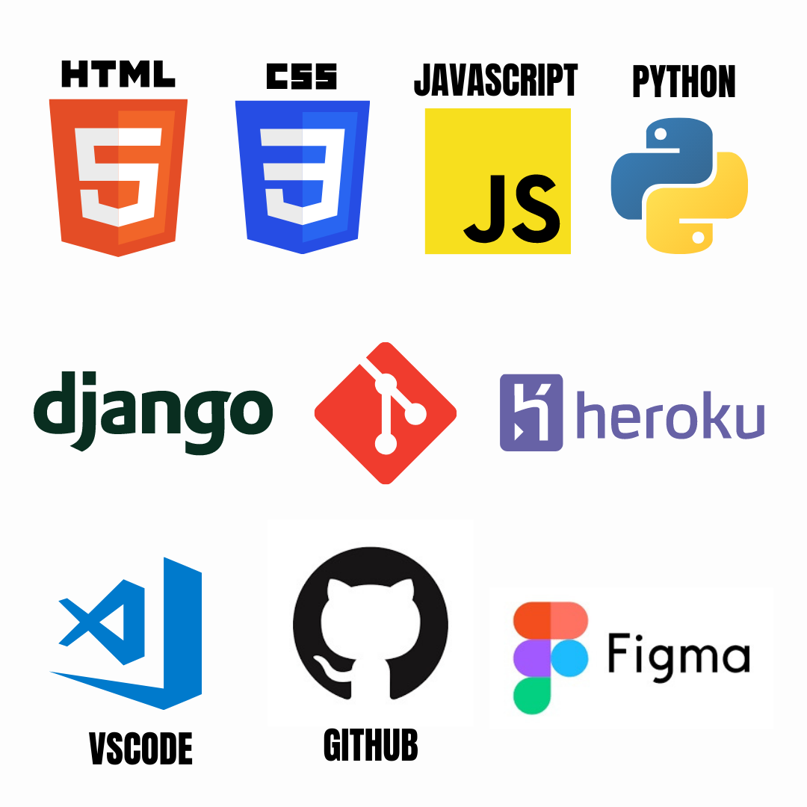

# CHUNK_FILE (TEAM FROGPP)
## Introduction.
Chunk_Files is an online platform that allows individuals to upload large CSV or JSON files and splits the dataset in the uploaded CSV or JSON file into multiple files as specified by the user making use of available option such as size of each new file.
## Objectives
+ Allow users split large files.
+ Users should have the ability to save the files for later and download.
+ Users should be able to see history of previous file operations performed.
## Solution
+ A tool for splitting CSV and JSON files as well as other file formats.
+ Easy download, import and save of CSV and JSON files.
+ Ability to perform split operations according to various parameters like size and number of rows.
+ Ability to view history of files chunked.
## Structure of the Webapp 
+ Landing page
This is the first page users interact with and provides them an overview of the Chunkit webapp. It includes the following 
* A nav bar where users can navigate to different sections of the webapp, such as the home, about us, contact us and services section.
* A sign-up button for new users, which leads to the sign up page
* A login button for existing users leading to the login page
* About ua section stating what we do and the type of files that can be chunked on the app
* A footer section which included our social media handles, frequently asked questions (FAQs), Terms of service and privacy policy.

+ Sign up page
This is the page for new users just getting started with the app. New users have to create an account by inputting their full name, email address and a strong password. They can also sign up through their Google or Facebook account.

+ Login page
On this page, existing users login to the app using the email address and password they used for signing up on the app. If a user forgets his/her password, there is also an option to recover their password.

+ Home page
On the home page, the users are welcomed to the app. They can navigate to chunking their files, downloading the chunked files, settings, contact us page and also log out of the webapp.

+ Chunk file section
This is the section where the app is put into action. On this page, users add the CSV or JSON files they want to chunk, by dragging/dropping the files or selecting a file from their computer. Once a file has been selected, users can select the sizes of chunks and the output of the chunked file. Afterwards, the users click on the chunk file button and wait for their file to be chunked and downloaded.

+ Privacy Policy 
This page entails the information we collect from users, how we use such information and user’s rights over access to their information 

+ Contact us
Users can get in touch with us through the contact us page. They input their name, email address and leave a message for us.

## Technologies Used

***Frontend***- HTML, CSS and JavaScript 
***Backend***- Python
***Design***-Figma
***Collaboration***-Github

### Languages 
+ HTML 
Hypertext Markup Language is the markup language for web pages. It serves as the structure of the web page. It enables us write texts, add images, videos and emojis to the web page.

+ CSS
Cascading Style Sheets is used to style and beautify the web page. We can add colors, change font size, add spacing and style the layout of the page 

+ JavaScript 
This is a programming language used to add functionality to the web page. It is used in combination with HTML and CSS to build websites.

+ Python
This is a high-level programming language used for web development, system scripting. It is the back end language we used in creating chunkit webapp.

## Software tools
+ Visual studio code 
This is a code-editor use for writing codes in different languages such as JavaScript, Python, Java, C and many more. It also aids in formatting and debugging of codes.

+ GitHub
This is a version control system used for storing, tracking and collaborating on software projects. It enables developers to store and  track changes in their codes while ensuring collaboration between developers.

+ Figma
The interface of the webapp was designed using Figma. Figma is a software collaborative design tool used for designing logos, websites interface and mobile applications interface.
Designers worked collaboratively on designing the interface of the Chunkit webapp, by developing a style guide to aid the design process. The link to the figma design 

## Features of the Webapp
+ The platform has many features which are accessible to both registered/authenticated  and unauthenticated users.
+ They can only view the documentation
+ They can register or login to make use of the platform.
+ They can see answers to FAQs
+ They can view an example of how the webapp is used
+ The following features are only available to authenticated user.
+ Auth. Users have full access to the Platform.
+ Auth. Users can upload a CSV or a JSON file.
+ Auth. Users can specify the sizes of each new file.
+ Auth. Users can download the chunked files in a zip file or separately.
+ Auth. Users can save the file and download later.
+ Auth. Users can view history of files chunked.
## Why use chunk_file?
+ Data analysis depends on the ability to find insight from data sets, however, some datasets can sometimes be voluminous to feed into data algorithms which will hinder the completion time of such algorithms, hence the need to feed data algorithms with small sets of data for learning. 
+ A society or a school record with a high number of data needs to be split into separate files for different analyses and classification.
+ Chunk_file allows you to specify the type of data format you want to receive (presently we have only CSV and JSON formats.).
## How to use chunk_file
+ Drag and drop your CSV or JSON file into the allocated space or Select upload file and choose a file from your directory 
+ Select the sizes of the chunked files [for unequal sizes seperste sizes by comma e g (2Mb, 3Mb, 1.4Mb etc)].
+ Select the output file format (CSV or JSON).
+ Select either to doe load zip or seperate files.
+ Click on chunk file to chunk your files 
+ Select Download to download the zip or seperate files.
## FAQs
+ What is CSV? A CSV file is information seperated using commas, It’s a way to exchange structured information, like the contents of a spreadsheet. Due to its simplicity, CSV can be used by virtually anyone who examines data in spreadsheets and tables. We offer splitting and conversion of CSV files. This tool allows you to split large CSV files into smaller files based on your specicification.
+ What is JSON? JSON is an open standard file format for sharing Data that uses human-readable text to store and transmit data. It is a general data format used with different applications, including web applications. It is a lightweight format for storing and transporting data. Web Developers use JSON to transmit data from the server to the web browser and from the web browser back to the server.
+ Why do I need to split CSV? Some systems are limited in terms of the size of data they can process. In this case, it is then necessary to split the CSV/JSON files so that they are processed. In other cases, the limitation is at the level of the sending of the data (although a compressed CSV normally takes up little space, the text being easily compressed).
+ How do I split my CSV files? To split your CSV file, follow these simple steps: Sign in to your dashboard (if you don’t have an account, create one and Sign in) Upload the CSV file(s) to our servers for splitting Download or save your chunked files
+ How do I split my JSON files? To split your JSON file, follow these simple steps: Sign in to your dashboard (if you don’t have an account, create one and Sign in) Upload the JSON file(s) to our servers for splitting Download or save your chunked files
+ Are my files stored on the site? Every user is given the option to have their chunked files stored on our servers. The storage of chunked files is not automatic and is at the choice of each user. Files not saved will be kept in the drafts on the dashboard for a very limited amount of time.
+ How long are files stored on the site? Draft files are stored for 24 hours only.
+ Are my stored files secure? YES. Every action happens on your local system. it doesnt go to our Database.
+ What is the maximum file upload size? The maximum upload size is 5Gb, pending updates to the server.
+ Can i change the output file format? Yes, you can specify the output format to either JSON or CSV, other file formats will be available on server updates.

### To visit the website click the link below
https://zuri-training.github.io/TeamFrogpp/

